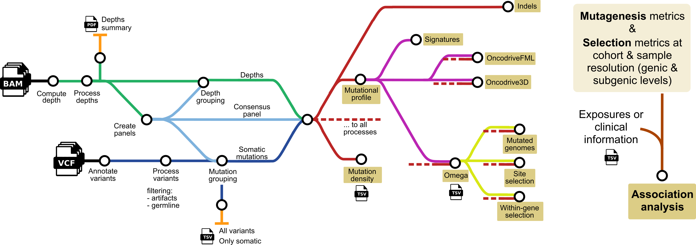

# deepCSA

## Introduction

**bbglab/deepCSA** is a bioinformatics pipeline that can be used for analyzing the clonal structure information from targeted DNA sequencing data. It was designed for duplex sequencing data of normal tissues.



## Usage

You can find a detailed documentation in the [docs section](docs/README.md), but here there is a minimal summary on how to prepare the inputs. Still for your first runs if you need to make the complete set up you have to check the deeper documentation.

First, prepare a samplesheet with your input data that looks as follows:

`samplesheet.csv`:

```csv
sample,vcf,bam
sample1,sample1.filtered.vcf,sample1.sorted.bam
sample2,sample2.filtered.vcf,sample2.sorted.bam
```

Each row represents a single sample with a single-sample VCF containing the mutations called in that sample and the BAM file that was used for getting those variant calls. The mutations will be obtained from the VCF and the BAM file will be used for computing the sequencing depth at each position and using this for the downstream analysis.

Two alternative input modes are also supported: a samplesheet with only `sample,vcf` columns combined with a precomputed depths table, or a single cohort-level MAF file passed via `--input_maf` together with a precomputed depths table. See [Input scenarios](docs/input_scenarios.md) for details.

**Make sure that you do not use any '.' in your sample names, and also use text-like names for the samples, try to avoid having only numbers.** This second case should be handled properly but using string-like names will ensure consistency.

**There are specific datasets that need to be prepared before running deepCSA. You can find a list of those, and instructions for downloading them in [the documentation section of the repo](docs/usage.md#mandatory-parameter-configuration).**

After making sure that these files are ready, you can now run the pipeline using:

```bash
git clone https://github.com/bbglab/deepCSA.git
cd deepCSA
nextflow run main.nf --outdir <OUTDIR> -profile singularity,<DESIRED PROFILE> -params-file pipeline_params.yml
```

The input can be provided by the `--input` option but it is more recommended to define this and all the other parameters in a parameter file (i.e. `pipeline_params.yml`), that can be provided to the pipeline for running the analysis with the specified configuration. This will also allow the definition of the remaining required parameters.

## Credits

bbglab/deepCSA was originally written by Ferriol Calvet.

We thank the following people for their extensive assistance in the development of this pipeline:

* @rblancomi
* @FedericaBrando
* @koszulordie
* @St3451
* @AxelRosendahlHuber
* @andrianovam
* @migrau
* @rochamorro1
* @m-huertasp

## Citations

An extensive list of references for the tools used by the pipeline can be found in the [`CITATIONS.md`](CITATIONS.md) file.

This pipeline uses code and infrastructure developed and maintained by the [nf-core](https://nf-co.re) community, reused here under the [MIT license](https://github.com/nf-core/tools/blob/master/LICENSE).

> **The nf-core framework for community-curated bioinformatics pipelines.**
>
> Philip Ewels, Alexander Peltzer, Sven Fillinger, Harshil Patel, Johannes Alneberg, Andreas Wilm, Maxime Ulysse Garcia, Paolo Di Tommaso & Sven Nahnsen.
>
> _Nat Biotechnol._ 2020 Feb 13. doi: [10.1038/s41587-020-0439-x](https://dx.doi.org/10.1038/s41587-020-0439-x).

## Documentation

Find the documentation ([link to docs](https://github.com/bbglab/deepCSA/tree/main/docs)).

We are working to provide the biggest possible detail on the [usage](docs/usage.md) and explanation of the rationale and [tools](docs/tools.md), but this is still in progress.

## Publications

> **Sex and smoking bias in the selection of somatic mutations in human bladder**
>
> Ferriol Calvet*, Raquel Blanco Martinez-Illescas*, Ferran Muiños, Maria Tretiakova, Elena S. Latorre-Esteves, Jeanne Fredrickson, Maria Andrianova, Stefano Pellegrini, Axel Rosendahl Huber, Joan Enric Ramis-Zaldivar, Shuyi Charlotte An, Elana Thieme, Brendan F. Kohrn, Miguel L. Grau, Abel Gonzalez-Perez, Nuria Lopez-Bigas & Rosa Ana Risques
>
>_Nature_ (2025) doi:[10.1038/s41586-025-09521-x](https://doi.org/10.1038/s41586-025-09521-x)
>
> *these authors contributed equally and the order was decided randomly

&

> **DeepClone, an end-to-end protocol to study somatic mutagenesis and selection at high resolution**
>
> Ferriol Calvet, Morena Pinheiro-Santin, Erika Lopez, Raquel Blanco Martinez-Illescas, Núria Samper, Miguel L. Grau, Ferran Muiños, Rocío Chamorro González, Maria Andrianova, Federica Brando, Stefano Pellegrini, Marta Huertas, Elisabet Figuerola-Bou, Coohleen Coombes, Brendan F. Kohrn, Jeanne Fredrickson, Rosa Ana Risques, Nuria Lopez-Bigas, Abel Gonzalez-Perez
>
> _protocols.io_ (2026) doi:[10.17504/protocols.io.dm6gp1jodgzp/v2](https://dx.doi.org/10.17504/protocols.io.dm6gp1jodgzp/v2)
