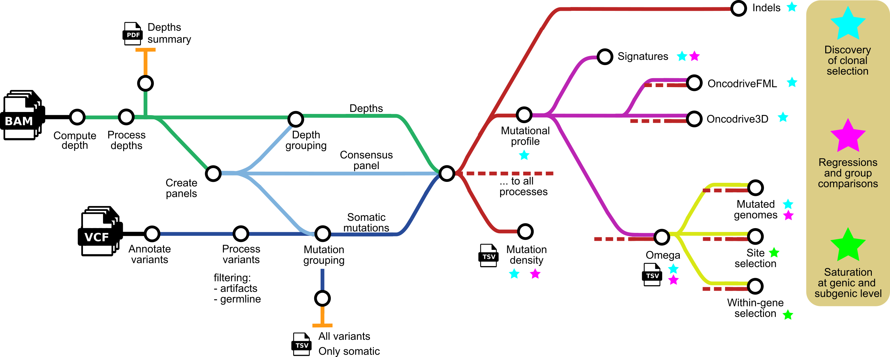

# deepCSA

## Introduction

**bbglab/deepCSA** is a bioinformatics pipeline that can be used for analyzing the clonal structure information from targeted DNA sequencing data. It was designed for duplex sequencing data of normal tissues.



<!-- TODO nf-core: Include a figure that guides the user through the major workflow steps. Many nf-core
     workflows use the "tube map" design for that. See https://nf-co.re/docs/contributing/design_guidelines#examples for examples.   -->
<!-- TODO nf-core: Fill in short bullet-pointed list of the default steps in the pipeline -->

<!-- 1. Read QC ([`FastQC`](https://www.bioinformatics.babraham.ac.uk/projects/fastqc/))
2. Present QC for raw reads ([`MultiQC`](http://multiqc.info/)) -->

## Usage

First, prepare a samplesheet with your input data that looks as follows:

`samplesheet.csv`:

```csv
sample,vcf,bam
sample1,sample1.high.filtered.vcf,sample1.sorted.bam
sample2,sample2.high.filtered.vcf,sample2.sorted.bam
```

Each row represents a single sample with a single-sample VCF containing the mutations called in that sample and the BAM file that was used for getting those variant calls. The mutations will be obtained from the VCF and the BAM file will be used for computing the sequencing depth at each position and using this for the downstream analysis.

**Make sure that you do not use any '.' in your sample names, and also use text-like names for the samples, try to avoid having only numbers.** This second case should be handled properly but using string-like names will ensure consistency.

**There are specific datasets that need to be prepared before running deepCSA. You can find a list of those, and instructions for downloading them in [the documentation section of the repo](docs/usage.md#mandatory-parameter-configuration).**

After making sure that these files are ready, you can now run the pipeline using:

<!-- TODO nf-core: update the following command to include all required parameters for a minimal example -->

```bash
git clone https://github.com/bbglab/deepCSA.git
cd deepCSA
nextflow run main.nf --outdir <OUTDIR> -profile singularity,<DESIRED PROFILE> -params-file pipeline_params.yml
```

The input can be provided by the `--input` option but it is more recommended to define this and all the other parameters in a parameter file (i.e. `pipeline_params.yml`), that can be provided to the pipeline for running the analysis with the specified configuration. This will also allow the definition of the remaining required parameters.

### Warning

Please provide pipeline parameters via the Nextflow `-params-file` option or CLI. Custom config files including those
provided by the `-c` Nextflow option can be used to provide any configuration **except for parameters**_;
see [docs](https://nf-co.re/usage/configuration#custom-configuration-files).

## Credits

bbglab/deepCSA was originally written by Ferriol Calvet.

We thank the following people for their extensive assistance in the development of this pipeline:

* @rblancomi
* @FedericaBrando
* @koszulordie
* @St3451
* @AxelRosendahlHuber
* @andrianovam
* @migrau

<!-- TODO 
## Contributions and Support

If you would like to contribute to this pipeline, please see the [contributing guidelines](.github/CONTRIBUTING.md).
 -->

## Citations

<!-- TODO nf-core: Add citation for pipeline after first release. Uncomment lines below and update Zenodo doi and badge at the top of this file. -->
<!-- If you use  bbglab/deepCSA for your analysis, please cite it using the following doi: [10.5281/zenodo.XXXXXX](https://doi.org/10.5281/zenodo.XXXXXX) -->

<!-- TODO nf-core: Add bibliography of tools and data used in your pipeline -->

An extensive list of references for the tools used by the pipeline can be found in the [`CITATIONS.md`](CITATIONS.md) file.

This pipeline uses code and infrastructure developed and maintained by the [nf-core](https://nf-co.re) community, reused here under the [MIT license](https://github.com/nf-core/tools/blob/master/LICENSE).

> **The nf-core framework for community-curated bioinformatics pipelines.**
>
> Philip Ewels, Alexander Peltzer, Sven Fillinger, Harshil Patel, Johannes Alneberg, Andreas Wilm, Maxime Ulysse Garcia, Paolo Di Tommaso & Sven Nahnsen.
>
> _Nat Biotechnol._ 2020 Feb 13. doi: [10.1038/s41587-020-0439-x](https://dx.doi.org/10.1038/s41587-020-0439-x).

## Documentation

Find the documentation ([link to docs](https://github.com/bbglab/deepCSA/tree/main/docs)).
