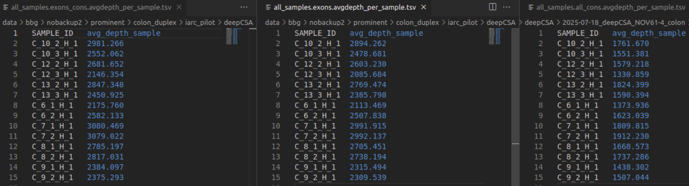

# bbglab/deepCSA: Output

## Introduction

This document describes the output produced by the pipeline.

## Pipeline overview 

The pipeline is built using [Nextflow](https://www.nextflow.io/) and processes data using the following steps:

- [Directory Structure](#directory-structure)
- [Input and configuration](#input-and-configuration)
- [Depth analysis](#depth-analysis)
- [Mutation preprocessing](#mutation-preprocessing)
- [Basic analysis](#basic-analysis)
- [Intermediate outputs](#intermediate-outputs)
- [Positive selection](#positive-selection)
- [Site selection metrics](#site-selection-metrics)
- [Additional clonal structure metrics](#additional-clonal-structure-metrics)
- [Mutational signatures](#mutational-signatures)
- [Plotting functionalities](#plotting-functionalities)
- [QC outputs](#qc-outputs)
- [Additional outputs](#additional-outputs)

## Directory Structure

The directory tree below shows the maximum diversity of outputs the pipeline can publish. When only some run options are turned on, only the corresponding subdirectories will be generated. All paths are relative to the top-level results directory.

```{console}
{outdir}
├── depths
│   ├── individual                 # per-sample depth tables
│   ├── plots_per_group            # depth plots split by sample groupings
│   └── summary                    # exons / exons_cons / all_cons depth summaries
├── group_definition
│   ├── genes
│   └── samples
├── mutations
│   ├── germline_somatic           # all calls labelled germline + somatic
│   ├── clean_somatic              # somatic calls after filtering
│   └── clean_germline_somatic     # cleaned germline + somatic
├── mutational_profile             # trinucleotide profiles (all / exons / introns / non-prot / synonymous)
├── mutdensity
│   └── individual_vals            # flat mutation density per sample/group
├── mutdensity_adjusted
│   └── individual_vals            # trinucleotide-adjusted mutation density
├── regions
│   ├── allsites                   # captured positions ready for VEP
│   ├── annotations                # panel annotation tables and plots
│   ├── capturedpanels             # per-region captured panels
│   ├── consensuspanels            # consensus panels (cohort-level)
│   ├── samplepanels               # per-sample panels per region type
│   │   ├── createsamplepanelsall
│   │   ├── createsamplepanelsexons
│   │   ├── createsamplepanelsintrons
│   │   ├── createsamplepanelsnonprotaffect
│   │   ├── createsamplepanelsprotaffect
│   │   └── createsamplepanelssynonymous
│   ├── expandedregions            # subgenic / domain / exon expansions
│   ├── panelannotation
│   └── dndscv                     # biomart filtered by panel BED (dynamic RefCDS input)
├── selection
│   ├── omega
│   │   ├── preprocessing          # syn_muts.<sample>, mutabilities.<sample>
│   │   └── estimator              # all_omegas.tsv, output_mle.<sample>.tsv
│   ├── omegagloballoc
│   │   ├── preprocessing
│   │   └── estimator
│   ├── sitecomparison             # background × count combinations
│   │   ├── bckg_single_count_single
│   │   ├── bckg_single_count_multi
│   │   ├── bckg_multi_count_single
│   │   ├── bckg_multi_count_multi
│   │   ├── bckg_glocsingle_count_single
│   │   ├── bckg_glocsingle_count_multi
│   │   ├── bckg_glocmulti_count_single
│   │   └── bckg_glocmulti_count_multi
│   ├── oncodrivefml
│   ├── oncodrive3d
│   │   └── run                    # per-sample Oncodrive3D results
│   ├── dndscv                     # dNdScv (R) outputs
│   │   ├── cv                     # *.cv.tsv
│   │   ├── persample              # *.globaldnds.tsv
│   │   └── local                  # *.loc.tsv
│   └── dndsproxy                  # dN/dS proxy from adjusted vs synonymous densities
├── signatures
│   ├── sigprofilerassignment
│   ├── sigprofilerassignment_indels
│   ├── sigprofilermatrixgenerator
│   ├── signatures_hdp
│   └── hdp_decomposition_spa
├── plots
│   ├── mutations_summary          # plot_maf / plot_somatic_maf
│   ├── needle_plots               # per-sample, per-gene needles
│   ├── selection_summary
│   ├── selection
│   │   ├── omega
│   │   ├── omegagloballoc
│   │   └── oncodrive3d
│   │       └── chimerax
│   ├── gene_subgenic_selection
│   ├── saturation_proportions
│   └── interindividual_variability
├── qc
│   ├── trinucleotide_proportions
│   ├── mutational_profiles_comparison
│   ├── mutdensityqc
│   ├── metrics_vs_depth           # depth-vs-metric scatter PDFs + status TSVs
│   ├── mutationspecific
│   ├── omega_flagged
│   ├── evaluate_omega_globalloc
│   └── contamination
├── processing_files
│   ├── input_vcfs                 # per-sample VCFs (when --input_maf is used)
│   ├── all_possible_sites
│   ├── sumannotation
│   ├── synmutdensity
│   ├── synmutreadsdensity
│   ├── mutations_matrix
│   │   └── per_sample             # SBS matrices for signature analysis
│   ├── relativemutability
│   ├── flagged_positions
│   └── multiqc
├── regressions
├── pipeline_info
└── multiqc
```

## Input and configuration

See [Usage](usage.md) and [Input scenarios](input_scenarios.md) for an explanation of the required inputs, the three supported input modes, and the parameter presets for the four suggested run profiles.

## Depth analysis

### Key role

- Computation of depth per sample for each specific position.
  Most analyses are influenced by sequencing depth, so it is essential to correct for these values.

- Definition of regions to analyse.
  Only genomic areas that have been properly covered across samples will be used.

**Note 1:** There is a depth difference between the depth reported in the files under `depths/individual/` and the values reported per mutation. This difference is because Ns are not counted when computing the depth at the specific mutation position. Therefore VAF values are computed with N-discounted depth while other metrics are not.

### Detailed explanation of `depths/summary/` versions

In this directory you will find different versions of TSVs and PDFs summarising the depths of the samples/genes sequenced.

Each version provides slightly different information, as shown below:



- `exons` — average depth in all the exonic regions sequenced, regardless of consensus coverage.
- `exons_cons` — average depth in exonic regions reaching the minimum consensus depth threshold (i.e. exons within the well-covered regions).
- `all_cons` — average depth of all well-covered sequenced regions across the cohort, with no exonic/intronic distinction.

### Outputs

- `depths/` (individual, summary, plots_per_group)
- `regions/allsites/`, `regions/annotations/`, `regions/panelannotation/`
- `regions/capturedpanels/`, `regions/consensuspanels/`, `regions/samplepanels/`

Optional (subgenic / domain expansion):

- `regions/expandedregions/`
- `regions/annotations/` (domain and DNA-to-protein mapping outputs)

## Mutation preprocessing

### Key role

- VCF annotation with Ensembl VEP.
- VCF → MAF conversion, VAF computation, merge with annotation.
- Custom region annotation: user-defined consequence types for specific regions.
- Hotspot annotation: add known hotspots to the mutation table.
- Filtering:
  - Sample-level filters (e.g. VAF distortion via `vaf_distortion_threshold`).
  - Cohort-level filters (e.g. `other_sample_SNP`, `repetitive_variant`, `not_covered`, `not_in_exons`).
- Optional blacklist of mutations (see assets for example).
- Optional downsampling of mutations.

### Outputs

- `mutations/germline_somatic/`
- `mutations/clean_somatic/`
- `mutations/clean_germline_somatic/`
- `processing_files/sumannotation/`, `processing_files/flagged_positions/`

## Basic analysis

### Key role

- Mutation density computation — corrects the number of observed mutations by the number of sequenced nucleotides.
- Mutational profile computation — captures the mutation probability of each trinucleotide, in three different normalisation conditions.

### Outputs

- `mutdensity/individual_vals/`
- `mutdensity_adjusted/individual_vals/` (trinucleotide-adjusted; see [Tools — Adjusted mutation density](tools.md#adjusted-mutation-density))
- `mutational_profile/`
- `processing_files/mutations_matrix/` (per-sample SBS matrix)

## Intermediate outputs

### Key role

- Matrix concatenation — combine WGS-renormalised matrices for mutational signature analysis.
- Mutability calculation — compute relative mutabilities using depths and the mutational profile.
- Selection of the synonymous mutation rate used downstream.

### Outputs

- `processing_files/mutations_matrix/` (cohort-level concatenated matrix)
- `processing_files/relativemutability/`
- `processing_files/synmutdensity/`
- `processing_files/synmutreadsdensity/`

## Positive selection

### Key role

- Compute several positive selection metrics at the cohort level and per sample/group:
  - **OncodriveFML** — functional-impact bias.
  - **Oncodrive3D** — 3D protein clustering, optionally on raw VEP annotation.
  - **Omega** — dN/dS-based selection in defined regions (genes, exons, domains, hotspots, ...).
  - **dNdScv** — R implementation, run with a per-run RefCDS built dynamically from the panel BED + a biomart export (`dnds_biomart_ref`) + the genome FASTA. See [Tools — dNdScv](tools.md#dndscv).
  - **dN/dS proxy** — quick ratio of adjusted vs synonymous mutation densities, output as `*.gene_mutdensities_n_dnds.tsv`.
  - **Indels** — indel selection analysis.

### Outputs

- `selection/omega/{preprocessing,estimator}/`
- `selection/omegagloballoc/{preprocessing,estimator}/`
- `selection/oncodrive3d/run/`
- `selection/oncodrivefml/`
- `selection/dndscv/{cv,persample,local}/`
- `selection/dndsproxy/`

## Site selection metrics

### Key role

- Compute absolute mutabilities for each position.
- Compare the observed number of mutations per site to the expected number and estimate a site-selection value.

### Outputs

- `selection/sitecomparison/` (8 background × count combinations: `bckg_{single,multi,glocsingle,glocmulti}_count_{single,multi}/`)

## Additional clonal structure metrics

### Key role

- VAF-based definition of the number of mutated genomes.

### Outputs

- Subdirectories of the mutated-cells analyses are published under `selection/` and `mutations/` according to the configured grouping; the corresponding processes are `mutated_cells_from_vaf` and `mutated_genomes_from_vaf` (controlled by `params.mutated_cells_vaf`).

## Mutational signatures

### Key role

- Signature assignment with SigProfilerAssignment (optional custom signatures).
- HDP — Hierarchical Dirichlet Process signature extraction.
- SigProfilerExtractor is supported but must be run externally.

### Outputs

- `signatures/sigprofilerassignment/`
- `signatures/sigprofilerassignment_indels/`
- `signatures/sigprofilermatrixgenerator/`
- `signatures/signatures_hdp/`
- `signatures/hdp_decomposition_spa/`

## Plotting functionalities

### Key role

- Plot basic statistics on numbers and distribution of mutations in genes.
- Plot selection results (omega, OncodriveFML, Oncodrive3D, gene/subgenic saturation, interindividual variability).

### Outputs

- `plots/mutations_summary/`
- `plots/needle_plots/`
- `plots/selection_summary/`
- `plots/selection/{omega,omegagloballoc,oncodrive3d}/`
- `plots/gene_subgenic_selection/`
- `plots/saturation_proportions/`
- `plots/interindividual_variability/`

## QC outputs

### Key role

A `qc/` umbrella collects all the quality-control views; `qc/metrics_vs_depth/` always runs and produces depth-vs-metric scatter plots for raw and adjusted mutation densities and omega-globalloc.

### Outputs

- `qc/trinucleotide_proportions/`
- `qc/mutational_profiles_comparison/`
- `qc/mutdensityqc/`
- `qc/metrics_vs_depth/`
- `qc/mutationspecific/`
- `qc/omega_flagged/`
- `qc/evaluate_omega_globalloc/`
- `qc/contamination/`

## Additional outputs

### Key role

- Definition of sample/gene groups, expanded regions, regression configs, and pipeline-level reports.

### Outputs

- `group_definition/{samples,genes}/`
- `regions/expandedregions/`
- `regressions/`
- `multiqc/`
- `pipeline_info/`
- `processing_files/input_vcfs/` (when `--input_maf` is used)
